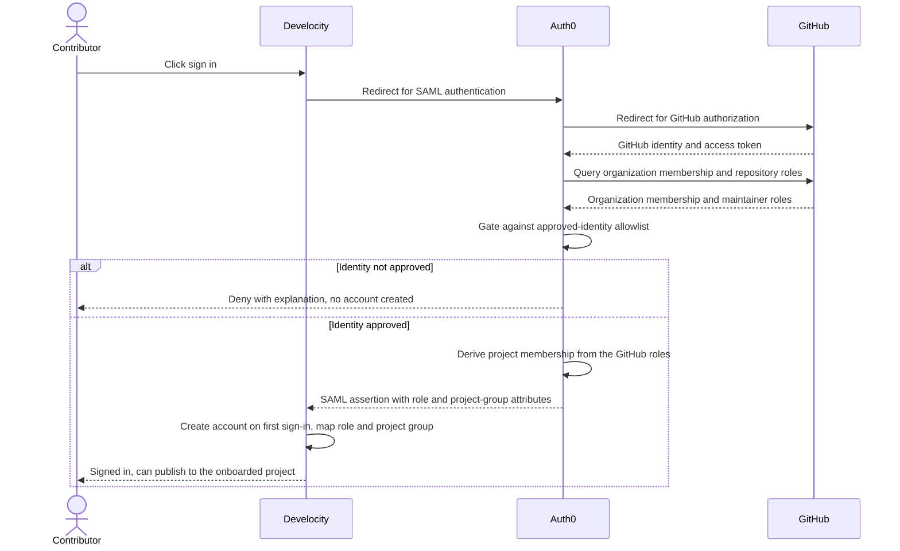
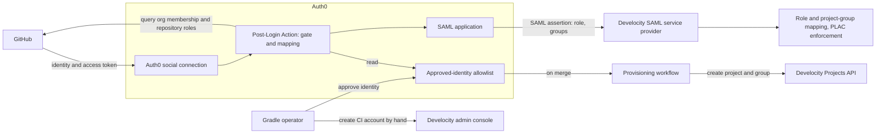

# Collected source: gradle/dv-design-docs PR #24
**Specification: Auth0 self-service signup for the Community Develocity Instance**

Reference material copied into this repository for context. It is **not** part of this
repository's experiment, and nothing here was written or edited here.

| | |
| --- | --- |
| Source | `gradle/dv-design-docs` pull request #24 (open at time of copy) |
| Branch | `solutions/clayburn/spec-auth0-community-signup` |
| Head commit | `34eb3cc4a4a02514c5980a250dbbfd80a5d2cb0e` |
| Copied | 2026-08-26 |
| Files | all 8 files added by the PR; no modified files existed |

Content below is **verbatim**, in the order listed. Nothing is summarised, shortened, reordered
within a file, or otherwise altered — including the files' own `#` headings, which are left at
their original levels. The only additions are the horizontal rules and the file-path labels that
mark where each file begins.

Because the source is an open pull request, this copy will drift if the branch is updated. Re-fetch
at a newer commit rather than editing it here.

## Contents

- `solutions/specification-auth0-community-signup/01-context.md`
- `solutions/specification-auth0-community-signup/02-functional-design.md`
- `solutions/specification-auth0-community-signup/03-usage-scenarios.md`
- `solutions/specification-auth0-community-signup/04-further-considerations.md`
- `solutions/specification-auth0-community-signup/05-implementation-design.md`
- `solutions/specification-auth0-community-signup/delivery-artifacts/allowlist-schema.md`
- `solutions/specification-auth0-community-signup/delivery-artifacts/develocity-idp-config.md`
- `solutions/specification-auth0-community-signup/delivery-artifacts/saml-attribute-contract.md`

---

`solutions/specification-auth0-community-signup/01-context.md`

# Auth0 self-service signup for the Community Develocity Instance

# Context

## What is the feature/work item?

This specification integrates Auth0 as the identity provider for the Community Develocity Instance at community.develocity.cloud.
Auth0 authenticates contributors through GitHub social sign-in.
Auth0 then federates to Develocity as a Security Assertion Markup Language (SAML) 2.0 identity provider.

The integration replaces two manual workflows with self-service signup.
Today a Gradle team member creates each user account and configures Project-Level Access Control (PLAC) by hand.
After this change, an approved contributor signs in with GitHub and the system provisions their access automatically.

A gate stays in place.
A contributor can sign in only when their GitHub organization or individual account appears on an approved-identity allowlist.
The Gradle team owns that allowlist, so signup stays controlled rather than open to everyone.

## What value does it add, and how, and to whom?

The manual onboarding process does not scale.
For each project, a Gradle team member collects the GitHub organization and committer list.
They then create a project group, a project identifier, a continuous integration (CI) service account, and a developer account per committer.
They finish by sending each user their project identifier and access-key instructions.
Every step is manual work in the Develocity administration console.

The instance keeps access controlled to ensure quality and prevent abuse.
Growth is intentional: the team decides which organizations and individuals to onboard, rather than opening the instance to everyone.

Self-service signup removes the manual work while keeping access controlled.
An approved maintainer signs in with GitHub and can publish to their projects without manual account setup.
The Gradle team approves a GitHub organization or individual once, rather than provisioning each user.

Two audiences benefit.
OSS maintainers and contributors get faster, lower-friction access to the Community Develocity Instance.
The Gradle team that operates the instance removes most of its recurring onboarding toil.

## How does it relate to other in-progress or planned work?

This work builds on the Community Develocity Instance described in [Proposal: Develocity Community Instance](https://docs.google.com/document/d/1H4oGBKsS2rx1oArr_6qSO9CvXEyLe_yfaBMOYGn0QGE/edit).
It replaces the manual steps in [Project Onboarding Steps](https://docs.google.com/document/d/1FX5o3SemdeuvcskaQgTSJa3XJfpmx0Uu2Apv9Q6UMxg/edit).
It depends on PLAC, which the Community Develocity Instance already uses to control who can publish each project's build data.
No other in-flight work depends on this change.

---

`solutions/specification-auth0-community-signup/02-functional-design.md`

# Functional design

## What context is necessary to understand the design?

Develocity authenticates people through a single external identity provider (IdP).
It supports Security Assertion Markup Language (SAML) 2.0 or LDAP, and only one at a time.
It does not support OpenID Connect (OIDC) for human login.
Auth0 therefore federates to Develocity over SAML 2.0, and uses GitHub for the actual sign-in.

A few Develocity concepts frame the rest of this document.

- A project is the unit of build-data isolation, identified by a project identifier.
- A project group is a collection of projects, assigned to users like a role.
- Project-Level Access Control (PLAC) governs who can publish a project's data, such as Build Scans and cache entries; the Community Develocity Instance keeps reads public through the "Anonymous permissions apply to all data" setting.
- A role, such as developer, grants a set of permissions like viewing and publishing Build Scans.
- An access key authenticates a build, separately from how a person signs in to the web interface.

The Community Develocity Instance enforces PLAC so each project's build data stays isolated.
Today the Gradle team creates every account and configures every project group by hand.

Auth0 sits between GitHub and Develocity.
GitHub is an upstream social connection that proves who the contributor is.
Auth0 is the downstream SAML identity provider that Develocity trusts.
The contributor never manages a separate Develocity password.

## How will it work *for the end user*?

A contributor visits community.develocity.cloud and clicks sign in.
Develocity redirects them to Auth0, and Auth0 redirects them to GitHub.
The contributor authorizes access through GitHub once, and GitHub returns their identity and organization membership.

Auth0 then runs the gate.
The gate checks the contributor's GitHub organization and account against an approved-identity allowlist.
When neither the organization nor the account is approved, Auth0 denies the sign-in with a clear message.
No Develocity account is created in that case, because the denial stops the SAML assertion from being issued.

When the identity is approved, Auth0 maps the contributor to the approved organization or account.
Each approved organization maps to exactly one Develocity project and one project group.
Every repository in that organization publishes its build data into that single project.
PLAC isolates build data between organizations, not between repositories within an organization.
A contributor who maintains any repository in the organization gains access to that one project.
Access never extends to organizations that are not onboarded, even when the contributor maintains repositories there.
Auth0 issues a SAML assertion that carries the contributor's email, name, role, and project-group membership.
Develocity creates the account on first sign-in, maps the role attribute to the developer role, and maps the project-group attribute to the matching project group.
The contributor can then publish to those projects, with no manual account setup.



The Gradle team controls access through the allowlist, a version-controlled file in a private GitHub repository the team owns.
A contributor requests access through a Google form that is shared privately and is not publicly listed.
A Gradle team member reviews the request and approves a GitHub organization or an individual GitHub account.
An organization entry onboards that organization's repositories into one Develocity project, and any maintainer in it can sign in.
An individual entry onboards that person's repositories into one Develocity project under their personal GitHub namespace, and lets them sign in.
Approving an entry unlocks self-service sign-in for that organization or individual.
That same approval provisions the Develocity project and project group right away.
Develocity creates each human account later, on that person's first sign-in.
Creating the CI service account is the one step that still needs an administrator.

People sign in to the web interface, but publishing build data uses an access key, not the SAML sign-in.
A maintainer signs in to the web interface and creates an access key for their own account to publish from local builds.
A continuous integration (CI) pipeline cannot sign in, so it uses a dedicated service identity with its own access key.
A Gradle administrator creates that CI service identity by hand during onboarding, because Develocity has no programmatic way to create an account.
The administrator delivers the CI account credentials, and the maintainer signs in as that account to create its access key and wire it into their CI provider.

Local Develocity accounts stay available as a fallback.
They cover identities that cannot use GitHub sign-in, break-glass administrator access, and service identities.
The design keeps these local accounts clear of the usernames and emails that GitHub sign-in produces, so the two never collide.

## Are there any known shortcomings that we are accepting?

Creating the CI service account stays a manual administrator step.
Develocity has no account-creation API, so this part of onboarding is not automated while the rest is.
We accept this because onboarding happens a few projects at a time, and we treat full automation as a future enhancement.

## What are we intentionally not doing?

We are not adding social providers beyond GitHub in this iteration.
The Community Develocity Instance onboards GitHub-hosted projects, so other providers add cost without clear demand.
A contributor without a usable GitHub account uses the local-account fallback.

We are not exposing public self-service signup.
Access requests go through a private form, and a Gradle team member approves each one.

We are not auto-deprovisioning users when they leave a GitHub organization.
Removal stays a manual step until provisioning via the System for Cross-domain Identity Management (SCIM) is in place.

## How could we improve or build upon this in the future?

- Use SCIM to deprovision a user automatically when they leave an approved GitHub organization.
- Automate CI service account creation once Develocity offers an account and access-key provisioning API.
- Support additional social providers for projects hosted outside GitHub.

---

`solutions/specification-auth0-community-signup/03-usage-scenarios.md`

# Usage scenarios

## A maintainer of an approved organization signs in

The persona is a maintainer of an OSS project owned by a GitHub organization.
The Gradle team has already approved that organization on the allowlist.
The maintainer wants to publish Build Scans and write to the build cache for the organization's project.
Reading is already public, so signing in is about gaining write access.

Before this feature, the maintainer waited for a Gradle team member to create an account and send credentials.
That exchange happened over a Slack channel and took as long as the team's queue allowed.

The maintainer now opens community.develocity.cloud and clicks sign in.
Auth0 sends them to GitHub, where they authorize access once.
Auth0 confirms their organization is approved and that they maintain a repository in it.
Develocity creates their account on first sign-in and scopes it to the organization's project.

After signing in, the maintainer can write to the organization's project with no manual account setup.
They generate an access key for their local builds, and connect their CI pipeline using its own service account.

## An approved individual contributor signs in

The persona is a solo maintainer who publishes a project under a personal GitHub account.
There is no GitHub organization behind the project, only the individual account.
The maintainer wants the same access as a maintainer inside an organization.

Before this feature, individuals were onboarded by hand just like organizations.
The manual process treated a personal namespace as a special case, which added confusion.

The Gradle team approves the individual GitHub account on the allowlist.
The maintainer signs in through GitHub, and Auth0 confirms the account is approved.
Develocity creates the account and scopes it to the maintainer's personal project.

After signing in, the maintainer can write to their personal project right away.
They publish Build Scans from both local builds and their CI pipeline, under the project boundary that PLAC enforces for everyone else.

## A contributor from a non-approved identity is denied

The persona is a developer whose GitHub organization is not on the allowlist.
They heard about the Community Develocity Instance and want to try it.

Before this feature, there was no self-service path at all, so the question never reached a login screen.

The developer opens community.develocity.cloud and clicks sign in.
Auth0 sends them to GitHub, and they authorize the application.
The gate finds no approved organization or account for them.
Auth0 denies the sign-in and shows a message that points to the access-request form.

No Develocity account is created, because the denial stops the SAML assertion.
The developer follows the message to ask the Gradle team for approval, and the gate grants no access until then.

## The Gradle team approves a new organization

The persona is the Gradle team member who operates the Community Develocity Instance.
A maintainer has asked to onboard a new GitHub organization.
The operator wants to grant access without manual console steps.

Before this feature, the operator created a project group, a project identifier, a CI service account, and a developer account per committer by hand.
Each onboarding consumed console time and was easy to get subtly wrong.

The operator reviews the request and adds the GitHub organization to the approved-identity allowlist in the team's private repository.
That action provisions the Develocity project and its project group.
The operator also creates the CI service identity by hand, the one step that stays manual.
From then on, any maintainer in that organization can self-serve sign in.

The operator confirms the new entry and moves on.
The recurring per-user work that the old process required is gone.

## A maintainer wires a CI pipeline

The persona is a maintainer who already signs in to the Community Develocity Instance.
They want their continuous integration pipeline to publish Build Scans and use the build cache.

Before this feature, a Gradle team member created the CI account and key by hand for each project.

Creating the CI service identity stays a small manual step for an administrator, because Develocity has no account-creation API.
The administrator creates the account, assigns its roles and project group, and gives the maintainer the account credentials.
The maintainer signs in as the CI account, generates its access key, and wires it into their CI provider.
The pipeline authenticates with the key, which is scoped to the same project as the maintainer's human access.

The pipeline publishes Build Scans and reads and writes the build cache within the project boundary.
PLAC keeps the pipeline's writes scoped to its project, exactly as it does for human users.

---

`solutions/specification-auth0-community-signup/04-further-considerations.md`

# Further considerations

## Dogfooding and functional testing

We validate the integration non-disruptively on community.develocity.cloud itself.
The instance keeps its current local accounts working while we configure and test the new path, so existing users are unaffected.

We drive the functional tests with a dedicated test GitHub organization and account that we control.

- An approved-organization member signs in and gains write access to the right project group.
- A non-approved identity is denied, and no Develocity account is created.
- Approving an organization provisions its project and project group, and a repeat approval stays idempotent.
- A continuous integration (CI) access key authenticates and respects Project-Level Access Control (PLAC).

We onboard one pilot organization through the new flow and confirm parity with the manual process.
We retire the manual steps only after the pilot succeeds.

## Development costs

The development cost is the engineering time to build and wire the integration.

- Auth0 configuration: a GitHub social connection, a SAML application, and a Post-Login Action for the gate.
- The approved-identity allowlist store and the logic that reads it during sign-in.
- The provisioning integration that creates projects and project groups through the Develocity API.
- Migration tooling that reconciles existing local accounts so they do not block sign-in.

We do not anticipate new infrastructure for this change.

## Operational costs

The main operational question is the Auth0 plan tier.
Staying on the current Auth0 plan tier is a requirement: the integration must not force an upgrade.
The design uses only features the target self-service tier includes.

| Auth0 feature | Used for | Plan-tier consideration |
|---------------|----------|-------------------------|
| GitHub social connection | Sign-in | Social connections are unlimited on the free tier; sign-ins count against the free cap of 25,000 monthly active users |
| Actions (Post-Login) with external calls | The gate and claim mapping | The free tier allows 5 Actions and the design uses one; needs no enterprise connection |
| SAML2 Web App addon | Auth0 acting as SAML identity provider to Develocity | Available on the free tier; distinct from tier-gated enterprise connections |
| Organizations | Optional grouping, not required here | Included on all plans; this design does not depend on it |
| Enterprise SAML connection | Not used | Tier-gated; the design avoids it |
| Machine-to-machine token add-on | Not used | The provisioning call uses a Develocity token against the Develocity API, so no Auth0 add-on is needed |

The SAML2 Web App addon is available on the free tier, so making Auth0 the Develocity identity provider does not force an upgrade.
Only SAML enterprise connections, where Auth0 federates to a customer's own identity provider, require a paid plan, and the design does not use them.

The free tier sets two limits that matter here: 25,000 monthly active users and 5 Actions.
The Community Develocity Instance authenticates human maintainers, whose sign-ins stay well within the monthly-active-user cap.
The design runs a single Post-Login Action, within the 5-Action limit.
The free tier also caps machine-to-machine token issuance at 1,000 per month, but this design issues no Auth0 machine-to-machine tokens.
The gate and the provisioning workflow authenticate to the GitHub and Develocity APIs with their own credentials, not with Auth0 tokens, so the token quota does not bind.

Other operational costs are small: the Auth0 tenant subscription and the time to maintain the allowlist.

## Install, upgrade, deployment

The Develocity side is a configuration change, not a deployment.
An administrator sets the external identity provider to SAML 2.0, points it at Auth0, and configures the attribute, role, and project-group mappings.
Applying the change restarts Develocity and may take several minutes.

The Auth0 side is external software as a service, so it adds no load to the Develocity cluster.
The allowlist is a version-controlled file in a private GitHub repository, and the provisioning integration runs as a GitHub Actions workflow on changes to it.
The implementation design covers both.
No central-processing-unit or Helm chart changes are required.

## Observability and support

Auth0 logs every sign-in and every Action run, including each gate denial and its reason code.
The team uses those Auth0 logs to support contributors and spot abuse.
The provisioning workflow runs in GitHub Actions, whose run logs record each project and project group it creates.

The denial message routes a blocked contributor to the request-access path.
This keeps support load low and gives the Gradle team a clear signal of demand.

## Security

This work adds a new authentication integration and a new web-facing signup path.
A security review is mandatory for this change.
Please reach out to security at [#dv-app-security](https://gradle.slack.com/archives/C03GHU96JF3).

The main security concerns and their mitigations follow.

- Trust boundary: Develocity trusts SAML assertions from Auth0, so the SAML signing keys and metadata must be protected and rotated.
- Least-privilege scopes: the GitHub social connection requests only the scopes it needs, such as `read:org`, `read:user`, and `user:email`, and the spec justifies each one.
- Secret handling: every credential the integration uses is stored in its platform's secret store and rotated; the inventory below lists each one.
- Fail closed: when the allowlist lookup or the GitHub check errors, the gate denies the sign-in rather than allowing it.
- Multi-tenant isolation: a mapping error could grant cross-project access, so PLAC enforces the project boundary and allowlist changes are reviewed before merge.
- Migration safety: reconciling existing local accounts must avoid both lockout and accidental privilege escalation.
- Shared CI credentials: onboarding hands a maintainer the CI service account credentials, so the maintainer resets the account password on first sign-in, the account is scoped to one project group, and builds prefer short-lived access tokens over long-lived keys.

### Secret inventory

The integration relies on the secrets below, each stored in its platform's secret store and rotated.

| Secret | Held where | Purpose |
|--------|------------|---------|
| SAML signing key and certificate | Auth0 holds the private key; Develocity trusts the public certificate from the uploaded metadata | Signs and verifies the SAML assertion |
| GitHub OAuth app client ID and secret | Auth0 social connection | Backs the GitHub sign-in |
| GitHub token-retrieval credential | Auth0 Action secret | Reads the contributor's GitHub access token so the Action can query membership and repository roles, for example an Auth0 Management API client with `read:user_idp_tokens` |
| Allowlist read token | Auth0 Action secret | Reads the allowlist file from the private GitHub repository, scoped read-only to that one repository |
| Develocity Projects API token | GitHub Actions secret | Lets the provisioning workflow create projects and project groups |
| CI service account credentials | Develocity local account, delivered to the maintainer | Authenticates the maintainer to generate the CI access key |

The contributor's own GitHub access token is short-lived and the integration never persists it.

## Research

### Develocity documentation

- [Identity provider](https://docs.gradle.com/develocity/2026.1/administration/access-control/identity-provider/): supported identity providers and SAML attribute, role, and group mapping.
- [Project-Level Access Control](https://docs.gradle.com/develocity/2026.1/administration/access-control/project-level-access-control/): projects, project groups, and mapping from identity-provider groups.
- [Permissions and roles](https://docs.gradle.com/develocity/2026.1/administration/access-control/permissions-and-roles/): predefined roles and identity-provider role mapping.

### Auth0 documentation

- [GitHub social connection](https://marketplace.auth0.com/integrations/github-social-connection): profile and organization data and scope configuration.
- [Pre-User-Registration trigger](https://auth0.com/docs/customize/actions/explore-triggers/signup-and-login-triggers/pre-user-registration-trigger): confirms this trigger does not run for social connections, so the gate runs in a Post-Login Action.
- [Create namespaced custom claims](https://auth0.com/docs/secure/tokens/json-web-tokens/create-namespaced-custom-claims): how custom attributes reach the assertion.
- [SAML2 Web App addon](https://auth0.com/docs/authenticate/protocols/saml/saml-sso-integrations/enable-saml2-web-app-addon): Auth0 as a SAML identity provider, available on the free tier.
- [Auth0 pricing](https://auth0.com/pricing): plan tiers and feature availability.

### GitHub documentation

- [List repositories for the authenticated user](https://docs.github.com/en/rest/repos/repos): the `GET /user/repos` endpoint, its `affiliation` filter, and the per-repository permissions object the Action reads to detect maintainership.

### Internal context

- [Proposal: Develocity Community Instance](https://docs.google.com/document/d/1H4oGBKsS2rx1oArr_6qSO9CvXEyLe_yfaBMOYGn0QGE/edit): the controlled-access model and the multi-tenant design.
- [Project Onboarding Steps](https://docs.google.com/document/d/1FX5o3SemdeuvcskaQgTSJa3XJfpmx0Uu2Apv9Q6UMxg/edit): the manual process this feature replaces.

### Resolved questions

- Maintainer signal: the Action calls `GET /user/repos` with `affiliation=organization_member` and the contributor's token, then treats a repository whose `permissions` object reports `admin` or `maintain` as maintained. This distinguishes a maintainer from a contributor with write access. An individual is admitted by account match, because the `maintain` role exists only on organization repositories. Required scopes are `read:org`, `read:user`, and `user:email`; public OSS repositories expose the `permissions` object without a broader `repo` scope.
- Auth0 plan tier: the SAML2 Web App addon, where Auth0 is the identity provider, is available on the free tier. Only SAML enterprise connections, where Auth0 is the service provider, require a paid plan, and the design does not use them.

---

`solutions/specification-auth0-community-signup/05-implementation-design.md`

# Implementation design

## Technical overview

Auth0 is the single external identity provider (IdP) for the Community Develocity Instance, federating to Develocity over Security Assertion Markup Language (SAML) 2.0.
GitHub is an upstream social connection in Auth0 that performs the actual sign-in.
A Post-Login Action in Auth0 runs the gate, derives project membership from GitHub, and sets the attributes the SAML assertion carries.
Develocity maps those attributes to a role and to project groups, which Project-Level Access Control (PLAC) then enforces.

Two flows surround the sign-in.
On approval, a provisioning workflow creates the Develocity project and project group through the Projects API, and an administrator creates the CI service account by hand.
On every sign-in, the gate decides whether to issue a SAML assertion at all.



The detailed design below covers the parts where the approach is not obvious.
The SAML attribute contract and the Develocity configuration live in full under `delivery-artifacts/`.

## Detailed design

### The gate as a Post-Login Action

Auth0's Pre-User-Registration trigger does not run for social connections, so the gate cannot live there.
The gate runs as a Post-Login Action, which executes on every sign-in including the first.

The Action reads the GitHub identity from the login event, including the GitHub login and the user's organization membership.
It looks the identity up against the approved-identity allowlist.
The identity passes when the GitHub login is an approved individual, or when the user belongs to an approved organization.

When the identity fails, the Action calls `api.access.deny()` with a reason code and a user-facing message.
The denial halts the pipeline, so Auth0 issues no SAML assertion and Develocity creates no account.
When the identity passes, the Action sets the custom claims that become SAML attributes.

### The approved-identity allowlist

The allowlist is the single source of truth for who may sign in and what gets provisioned.
It lives as a version-controlled file in a private GitHub repository the Gradle team owns.
An approval is a change to that file, reviewed and merged like any other pull request, which gives an audit trail.

Two consumers read the file.
The provisioning workflow runs on merge and creates the Develocity project and project group for each new entry.
The Post-Login Action reads the file at sign-in and caches it briefly, so the gate stays fast.

The file is YAML with two top-level lists, `organizations` and `individuals`, plus a `version` field for forward compatibility.
Each entry carries a required `login`, the GitHub organization or user login, and an optional free-text `notes` field for the audit record.
The provisioning workflow derives a stable Develocity project identifier from each `login`.
A newline-separated list would also work, but YAML leaves room to add fields later without a format change.
`delivery-artifacts/allowlist-schema.md` holds the full field reference and an example.

### Deriving project membership from GitHub

A contributor enters as an approved individual, or by maintaining at least one repository in an approved organization.

The Action enumerates the contributor's repositories with the `GET /user/repos` endpoint, using the token from the GitHub social login.
It passes `affiliation=organization_member` so the listing covers only repositories the contributor reaches through the approved organization.
Each repository carries a `permissions` object with `admin`, `maintain`, `push`, `triage`, and `pull` boolean flags.
The Action treats the contributor as a maintainer when a repository's `permissions.admin` or `permissions.maintain` flag is true.
This distinguishes a maintainer from a contributor who only has write access.

An approved individual is admitted by account match, not by maintainership.
The `maintain` role exists only on organization repositories, so a personal repository instead reports its owner as `admin`.

Required scopes are `read:org`, `read:user`, and `user:email`.
The implementation confirms that public OSS repositories expose the `permissions` object under these scopes, without a broader `repo` scope.

The Action then maps the contributor to the project group for the whole approved organization or individual account.
A maintainer of any repository in an organization gains access to that organization's single project.
This organization-level scope is a deliberate choice, not a per-repository restriction.

The Action queries GitHub on every sign-in, which adds latency to the login path and uses GitHub API quota.
This is a possible concern at scale.
We do not anticipate hitting GitHub rate limits.
Each sign-in uses the contributor's own token and makes only a few calls.
That stays well under GitHub's per-token hourly limit, unless that limit is unexpectedly low.
A short-lived cache of the derived membership mitigates latency or quota pressure if it appears.

### The SAML attribute contract

The Auth0 SAML application maps Auth0 user attributes and custom claims to SAML assertion attributes.
Develocity reads those attributes to fill the profile, assign the role, and assign project groups.
The table summarizes the contract; `delivery-artifacts/saml-attribute-contract.md` holds the exact names and formats.

| Assertion attribute | Source | Develocity use |
|---------------------|--------|----------------|
| Email | GitHub email | Account email |
| Given name | GitHub profile | Account given name |
| Surname | GitHub profile | Account surname |
| Role | Set by the Action | Mapped to the developer role |
| Groups | The approved GitHub organization or individual account | Mapped to that organization's or account's project group |

Custom claims that are not standard profile fields use a namespaced claim name, as Auth0 requires.
The groups attribute is multi-valued, so a contributor who maintains projects in several approved organizations receives a project group for each.

### Develocity identity provider and PLAC configuration

An administrator configures the external IdP once.

- Set the external identity provider to SAML 2.0 and upload the Auth0 metadata.
- Create the matching SAML application at Auth0 using the displayed service-provider URL and entity identifier.
- Map given name, surname, and email to the SAML attribute names in the contract.
- Set role membership to "Defined by identity provider" and map the role attribute value `developer` to the developer role.
- Map project groups from the SAML groups attribute, so each project group binds to one external group value.

Develocity updates role and group membership on each sign-in or session refresh.
Applying access-control changes restarts services.

### Provisioning projects and project groups

Three objects are provisioned at three different times, which the design keeps distinct.

- The project and its project group are created at approval, when the operator merges the identity into the allowlist.
- Each human account is created at first sign-in, when Develocity reads the SAML assertion.
- The CI service account is created by an administrator during onboarding, covered in the next section.

A project and its project group must exist before the groups attribute can map to anything.
The design provisions them through the Develocity Projects API, which Gradle owns, when the operator merges an identity into the allowlist.
Provisioning on approval keeps the Action fast and ensures access is ready before the first sign-in.
Just-in-time provisioning during the Action stays the fallback if on-approval provisioning proves awkward.

Each approved organization or individual account maps to exactly one Develocity project and one project group.
Provisioning is idempotent because projects cannot be deleted.
The step derives a stable project identifier from the GitHub organization or account, checks whether the project exists, and creates it only when it does not.

### CI service identity and access-key provisioning

Publishing build data authenticates with access keys or short-lived access tokens, not with SAML.
PLAC with the build cache requires Authenticated Build Access, so continuous integration (CI) needs its own credential.

Each project gets a CI service identity with the `ci-agent` and `api-client` roles, assigned to the project's group.
The CI service identity is a local Develocity account, because it has no GitHub user behind it.

An administrator creates this account by hand at onboarding, rather than the provisioning workflow creating it.
This is a deliberate limitation.
Develocity exposes no REST API for creating accounts, and its one programmatic path, the System for Cross-domain Identity Management (SCIM) 2.0, provisions neither roles nor access keys.
Automating the CI account would add more complexity than it removes while onboarding happens a few projects at a time.

The administrator creates the account, assigns the roles and project group, and delivers the account credentials to the maintainer.
The maintainer signs in as the CI account, generates its access key, and wires it into their CI provider.
The design prefers short-lived access tokens over long-lived access keys where the build tool supports them.
Automating this step becomes worthwhile once Develocity offers an account and access-key provisioning API.

### Migrating existing accounts

The Community Develocity Instance has manually created local accounts whose usernames match GitHub usernames.
Develocity blocks IdP sign-in when a local account shares the username or email, so these accounts would block SAML sign-in.

Migration clears the conflict before SAML goes live for a given identity.

- Enumerate existing local accounts on the Community Develocity Instance.
- For accounts that map to an approved identity, remove the local account so SAML recreates it cleanly on first sign-in.
- Reproduce each user's project access through the SAML group mapping rather than manual assignment.
- Keep break-glass administrator accounts and CI service identities as local accounts on identifiers that GitHub sign-in never produces.

The migration sequences per identity to avoid a window where an approved user can sign in through neither path.

---

`solutions/specification-auth0-community-signup/delivery-artifacts/allowlist-schema.md`

# Approved-identity allowlist format

This artifact records the format of the approved-identity allowlist.
It supports the implementation design and is not part of the specification body.

The allowlist is a single YAML file in a private GitHub repository the Gradle team owns.
It is the source of truth for who may sign in and what the provisioning workflow creates.
An approval is a pull request that adds or edits an entry, which gives an audit trail through review and merge.

## Schema

- `version` (integer, required): the schema version, so the format can change without breaking older tooling.
- `organizations` (list, optional): approved GitHub organizations.
  - `login` (string, required): the GitHub organization login.
  - `notes` (string, optional): a free-text audit note, such as the approval date or request link.
- `individuals` (list, optional): approved individual GitHub accounts.
  - `login` (string, required): the GitHub user login.
  - `notes` (string, optional): a free-text audit note.

The provisioning workflow derives a stable Develocity project identifier from each `login`.
The Post-Login Action approves a contributor when their GitHub login matches an `individuals` entry, or when they belong to an `organizations` entry.

## Example

```yaml
version: 1

organizations:
  - login: acme-corp
    notes: "Approved 2026-06-01, request #142"
  - login: widgets-io

individuals:
  - login: alice-dev
    notes: "Solo maintainer, personal namespace"
```

## Notes

- A newline-separated list of logins would satisfy today's needs.
- The structured YAML form is chosen so fields can be added later, such as per-entry roles or contact metadata, without a format migration.
- Keys use the lower-case `login` name to match the GitHub field.

---

`solutions/specification-auth0-community-signup/delivery-artifacts/develocity-idp-config.md`

# Develocity identity provider configuration

This artifact records the Develocity administration settings for the Auth0 integration.
It supports the implementation design and is not part of the specification body.
See the [Develocity identity provider documentation](https://docs.gradle.com/develocity/2026.1/administration/access-control/identity-provider/) for the canonical reference.

## Console settings

Configure these under Administration, Access control, Identity provider.

1. Enable the external identity provider and select SAML 2.0.
2. Name the provider `Auth0`.
3. Create the SAML application at Auth0 using the displayed service-provider single sign-on URL and entity identifier.
4. Upload the Auth0 SAML metadata file as the identity-provider metadata.
5. Configure the attribute mappings, role mapping, and project-group mapping below.
6. Save, then apply to restart Develocity with the new settings.

## Attribute mappings

| Develocity field | SAML attribute |
|------------------|----------------|
| Given name | `givenName` |
| Surname | `surname` |
| Email | `email` |

## Role mapping

- Set role membership to "Defined by identity provider".
- Use `https://community.develocity.cloud/role` as the role attribute.
- Map the value `developer` to the Develocity developer role.

## Project-group mapping

- Map project groups from the `https://community.develocity.cloud/groups` attribute.
- Each external group value binds to one Develocity project group.
- Project groups are created on approval through the Develocity Projects API before first sign-in.

## Illustrative unattended configuration

This snippet sketches the external-provider and role shape for a GitOps-style deployment.
It is illustrative, not a complete configuration.

```yaml
version: 15
auth:
  external:
    saml:
      name: Auth0
      # metadata and service-provider settings configured via the console or values file
  roles:
    developer:
      assignToNewExternalUsers: false
      identityProviderAttributeValue: developer
```

## Notes

- Develocity supports one external identity provider at a time, SAML 2.0 or LDAP.
- Develocity blocks identity-provider sign-in when a local account shares the username or email.
- Applying access-control changes restarts services.

---

`solutions/specification-auth0-community-signup/delivery-artifacts/saml-attribute-contract.md`

# SAML attribute contract

This artifact records the SAML assertion attributes Auth0 emits and Develocity consumes.
It supports the implementation design and is not part of the specification body.

## Attributes

| Assertion attribute | Multi-valued | Source | Example | Develocity use |
|---------------------|--------------|--------|---------|----------------|
| `email` | No | GitHub email | `maintainer@example.com` | Account email |
| `givenName` | No | GitHub profile | `Alex` | Account given name |
| `surname` | No | GitHub profile | `Doe` | Account surname |
| `https://community.develocity.cloud/role` | No | Set by the Post-Login Action | `developer` | Mapped to the developer role |
| `https://community.develocity.cloud/groups` | Yes | Approved GitHub organization or individual account from the Action | `acme`, `widgets` (two attribute values) | Mapped to that organization's or account's project group |

## Namespacing

Standard profile attributes (`email`, `givenName`, `surname`) need no namespace.
Custom attributes (`role`, `groups`) use a namespaced name, as Auth0 requires for non-standard claims.
The namespace is a URL the team controls; it need not resolve to a live resource.

## Notes

- The `groups` attribute is multi-valued, sent as multiple SAML attribute values rather than a single delimited or JSON-encoded string, so a contributor who maintains projects in several approved organizations receives a value for each.
- Develocity maps the `role` value `developer` to the developer role under "Defined by identity provider".
- Each `groups` value is an approved GitHub organization or account, which binds to that organization's or account's project group.
